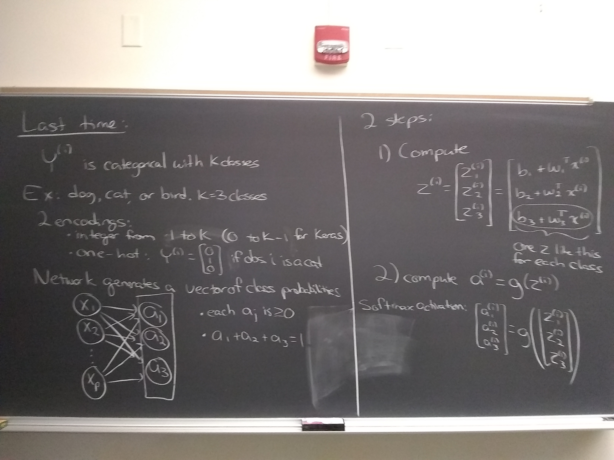

  
  **Click on the text like "Week 1: Jan 20 -- 24" to expand or collapse the items we covered in that week.**
  
  I will fill in more detail and provide links to lecture notes and labs as we go along.  Items for future dates are tentative and subject to change.

```{r, echo = FALSE}
make_week_box <- function(id, open, title, contents) {
  cat('
<div class="panel panel-default">
<div class="panel-heading" role="tab" id="headingOne">
<h5 class="mb-0">
<a data-toggle="collapse" href="#',
id,
'" aria-expanded="true" aria-controls="collapseOne">
',
title,
'</a>
</h5>
</div>

<div id="',
id,
'" class="collapse',
ifelse(open, " in", ""),
'">
<div class="panel-body">
',
contents,
'
</div>
</div>
</div>',
      sep = "")
}
```

```{r, echo = FALSE, results='asis'}
make_week_box("week1", FALSE, "Week 1: Jan 20 -- Jan 24", "

#### Wed, Jan 22
 * **In class**, we will work on:
    * Discuss [syllabus](syllabus/syllabus_stat_344ne.pdf), overview of course
    * Warm up examples:
        * Example 1: [pdf](materials/20200122_intro/20200122_ex1.pdf)
        * Example 2: [pdf](materials/20200122_intro/20200122_ex2.pdf)
        * Example 3: [pdf](materials/20200122_intro/20200122_ex3.pdf)
        * Lecture notes: [pdf](materials/20200122_intro/lecture_notes.pdf)
        * Python notebook: https://github.com/mhc-stat344ne-s2020/20200122_examples/blob/master/20200122_examples.ipynb
 * **After class**, please:
    * **Register for GitHub** [here](https://github.com) if you haven't already; I will ask you to provide your GitHub user name in the questionairre below.
    * **Fill out** a brief [questionnairre](https://docs.google.com/forms/d/e/1FAIpQLSfw9sGTYsHaA9D0NEuxLVVdD4QlQXDk59DFu0-E6KxLtnEhxw/viewform?usp=sf_link) (if you are taking two classes with me, you only need to fill out this questionairre once)
    * **Fill out** this brief [poll about when my office hours should be held](https://zvite.co/i/JbeK8Cyi) (if you are taking two classes with me, you only need to fill out this poll once)
    * **Sign up** for our class at Piazza (anonymous question and answer forum): [https://piazza.com/mtholyoke/spring2020/stat344ne](https://piazza.com/mtholyoke/spring2020/stat344ne)
    * **Reading**
        * Chollet:
            * Skim sections 1.1 -- 1.3.  This is pretty fluffy and we'll mostly either skip it or talk about it in much more depth later, but it might be nice to see now for a little context.
            * Read sections 2.1 -- 2.3 more carefully.  We will talk about this over the next day or two.
        * Goodfellow et al.:
            * Read the intro to section 5.5 (but don't worry about KL divergence), read section 5.5.1, lightly skim section 6.1, read the first 3 paragraphs of section 6.2.1.1, and skim sections 6.2.2.1, 6.2.2.2, and 6.2.2.3.  We will talk about this over the next day or two.
    * **Videos**
        * I moved the videos that were here to later days.
    * **Homework 1**
        * Written part due 5pm Wed, Jan 29
        * Coding part due 5 pm Fri, Jan 31


#### Fri, Jan 24
 * **In class**, we will work on:
    * Maximum likelihood and output activations for binary classification.  I don't have any lecture notes for this.
    * Matrix formulation of calculations for logistic regression across multiple observations.  I don't have any lecture notes for this, but it's written up in Lab 01.
    * Highlights of NumPy: https://github.com/mhc-stat344ne-s2020/Python_NumPy_foundations/blob/master/Python.ipynb
    * Lab 1: you do some calculations for logistic regression in NumPy.  You should receive an email from GitHub about this.
 * **After class**, please:
    * **Reading**
        * Continue/finish readings listed for Wed, Jan 22.
        * Take a look at the NumPy document listed above.  You can't run it directly on GitHub, but if you want you could sign into colab.research.google.com and try out some of the code there.  Also cross-reference this with the Numpy section in Chollet.
    * **Videos**:  Here are some videos of Andrew Ng talking about logistic regression and stuff we did today; you don't need to watch these, but feel free if you want a review:
        * Logistic regression set up: [youtube](https://www.youtube.com/watch?v=hjrYrynGWGA&list=PLkDaE6sCZn6Ec-XTbcX1uRg2_u4xOEky0&index=8)
        * Loss function just thrown out there without justification: [youtube](https://www.youtube.com/watch?v=SHEPb1JHw5o&list=PLkDaE6sCZn6Ec-XTbcX1uRg2_u4xOEky0&index=9)
        * Discussing set up for loss function via maximum likelihood: [youtube](https://www.youtube.com/watch?v=k_S5fnKjO-4&list=PLkDaE6sCZn6Ec-XTbcX1uRg2_u4xOEky0&index=24)
        * Start at thinking about \"vectorization\", i.e. writing things in terms of matrix operations: [youtube](https://www.youtube.com/watch?v=qsIrQi0fzbY&list=PLkDaE6sCZn6Ec-XTbcX1uRg2_u4xOEky0&index=17)
        * More on vectorization, but I think this video is more complicated than necessary and you might skip it: [youtube](https://www.youtube.com/watch?v=pYWASRauTzs&list=PLkDaE6sCZn6Ec-XTbcX1uRg2_u4xOEky0&index=18)
        * Vectorizing logistic regression.  Note that Andrew does this in the variant where your observations are in columns of the X matrix.  I want us to understand that you can also just take the transpose of that and get a just-as-valid way of doing the computations, just sideways.  This is worth understanding because different sources and different software packages will organize things different ways and you want mental flexibility.  We talked about this in class but I don't know of a video that explains things with the other orientation. [youtube](https://www.youtube.com/watch?v=okpqeEUdEkY&list=PLkDaE6sCZn6Ec-XTbcX1uRg2_u4xOEky0&index=19)
        * [Broadcasting in NumPy](https://www.youtube.com/watch?v=tKcLaGdvabM) -- This is among my least favorite examples, apologies!
    * **Homework 1**
        * Written part due 5pm Wed, Jan 29
        * Coding part due 5 pm Fri, Jan 31
")
```

```{r, echo = FALSE, results='asis'}
make_week_box("week2", FALSE, "Week 2: Jan 27 -- Jan 31", "
#### Mon, Jan 27
 * **In class**, we will work on:
    * Maximum likelihood and output activations for regression.  Lecture notes: [pdf](materials/20200127_regression_set_up/lecture_notes.pdf)
    * Lab 1 about numpy calculations relevant to logistic regression -- complete and turn in by Friday, Jan 31.
 * **After class**, please:
    * **Homework 1**
        * Written part due 5pm Wed, Jan 29
        * Coding part due 5 pm Fri, Jan 31
    * **Lab 1**
        * Due 5pm Fri, Jan 31


#### Wed, Jan 29
 * **In class**, we will work on:
    * Overview/details of maximum likelihood for logistic regression.  Demo visualization [here](https://evanlray.shinyapps.io/logistic_likelihood_entropy_interactive_plots/).
    * Overview/details of maximum likelihood for linear regression.  Demo visualization [here](https://evanlray.shinyapps.io/likelihood_rss_interactive_plots/).
    * Maximum likelihood and output activations for multi-class classification.  No lecture notes, but see the video linked below.
    * Summary of models, activation functions, and losses so far: [pdf](materials/20200129_models_and_losses/models_and_losses.pdf)
 * **After class**, please:
    * **Videos**
        * Some of you may find these videos helpful:
            * [Softmax regression](https://www.youtube.com/watch?v=LLux1SW--oM) is another word for multinomial regression, which is the equivalent to logistic regression for multi-class classification.
    * **Homework 1**
        * Written part due 5pm **today** Wed, Jan 29
        * Coding part due 5 pm Fri, Jan 31
    * **Lab 1**
        * Due 5pm Fri, Jan 31


#### Fri, Jan 31
 * **In class**, we will work on:
    * **Quiz** on logistic regression
    * Highlights from last class (see also first page of lecture notes below) 
    * More concrete example of calculations for multinomial logistic regression
        * Lecture notes: [pdf](materials/20200131_multinomial_logistic/lecture_notes.pdf)
        * We also wrote out that for $m$ observations,
        \\begin{align*}
z &= \\begin{bmatrix} z^{(1)} & \\cdots & z^{(m)} \\end{bmatrix} = \\begin{bmatrix} z^{(1)}_1 & \\cdots & z^{(m)}_1 \\\\ z^{(1)}_2 & \\cdots & z^{(m)}_2 \\\\ \\vdots & \\ddots & \\vdots \\\\ z^{(1)}_K & \\cdots & z^{(m)}_K \\end{bmatrix} \\\\
&= \\begin{bmatrix} b_1 + w_1^T x^{(1)} & \\cdots & b_1 + w_1^T x^{(m)} \\\\ b_2 + w_2^T x^{(1)} & \\cdots & b_2 + w_2^T x^{(m)} \\\\ \\vdots & \\ddots & \\vdots \\\\ b_K + w_K^T x^{(1)} & \\cdots & b_K + w_K^T x^{(m)}  \\end{bmatrix} \\\\
&= \\begin{bmatrix} b_1 \\\\ b_2 \\\\ \\vdots \\\\ b_K \\end{bmatrix} + \\begin{bmatrix} w_1^T \\\\ w_2^T \\\\ \\vdots \\\\ w_K^T \\end{bmatrix} \\begin{bmatrix} x^{(1)} & x^{(2)} & \\cdots & x^{(m)} \\end{bmatrix}
\\end{align*} where the last equals sign uses Python broadcasting to pull out the vector $b$.
        * Hand out doing the calculations: [pdf](materials/20200131_multinomial_logistic/20200131_multnomial_logistic.pdf)
    * General Python stuff (also posted on resources page)
        * Plotting with matplotlib [pdf](resources/matplotlib.pdf)
        * Basic use of Keras [pdf](resources/keras.pdf)
 * **After class**, please:
    * **Homework 1**
        * Coding part due 5 pm **today** Fri, Jan 31
    * **Lab 1**
        * Due 5pm Fri, Jan 31
    * **Homework 2**
        * Coding part due 5pm Fri, Feb 7
    * **Videos**
        * Some of you may find this sequence of three videos introducing Keras helpful (note that I will follow the code in Chollet, which differs slightly from code used in these videos):
            * Video 1: [data set up](https://www.youtube.com/watch?v=UkzhouEk6uY&list=PLZbbT5o_s2xrwRnXk_yCPtnqqo4_u2YGL&index=3)
            * Video 2: [defining the network](https://www.youtube.com/watch?v=Boo6SmgmHuM&list=PLZbbT5o_s2xrwRnXk_yCPtnqqo4_u2YGL&index=4)
            * Video 3: [training models](https://www.youtube.com/watch?v=EHbay6hDZGA&list=PLZbbT5o_s2xrwRnXk_yCPtnqqo4_u2YGL&index=5)")
```

```{r, echo = FALSE, results='asis'}
make_week_box("week3", FALSE, "Week 3: Feb 03 -- Feb 07", "
#### Mon, Feb 03
 * **In class**, we will work on:
    * Hidden layers and forward propagation.  Lecture notes: [pdf](materials/20200203_hidden_layers/lecture_notes.pdf).  Note there is an error on the bottom of page 1: for multinomial regression, you use a softmax activation, not a sigmoid activation.
    * Lab 02
 * **After class**, please:


#### Wed, Feb 05
 * **In class**, we will work on:
    * Gradient Descent, start on backpropagation for logistic regression.  Lecture notes: [pdf](materials/20200205_grad_descent_logistic/lecture_notes.pdf).  Note there is an error on page 6 that we did not make in class: $dJdz = a - y$, not $y - a$.
 * **After class**, please:
    * **Videos**
       * Andrew Ng discusses [Gradient Descent](https://www.youtube.com/watch?v=uJryes5Vk1o&list=PLkDaE6sCZn6Ec-XTbcX1uRg2_u4xOEky0&index=10)
       * Andrew Ng discusses [Derivatives in Computation Graphs](https://www.youtube.com/watch?v=nJyUyKN-XBQ&list=PLkDaE6sCZn6Ec-XTbcX1uRg2_u4xOEky0&index=14).  This video feels unnecessarily complicated to me, but you might find it helpful to see things worked out with actual numbers.
       * Andrew Ng discusses [Gradient Descent for Logistic Regression with 1 observation](https://www.youtube.com/watch?v=z_xiwjEdAC4&list=PLkDaE6sCZn6Ec-XTbcX1uRg2_u4xOEky0&index=15)
       * Andrew Ng discusses [Gradient Descent for Logistic Regression with m observatons](https://www.youtube.com/watch?v=KKfZLXcF-aE&list=PLkDaE6sCZn6Ec-XTbcX1uRg2_u4xOEky0&index=16).  But he uses a for loop that we really don't want.  He then gets rid of the for loop later, but I feel this is extra mental energy over what we did.
       * Andrew Ng discusses [Vectorizing Gradient Descent for Logistic Regression with m observatons](https://www.youtube.com/watch?v=2BkqApHKwn0&list=PLkDaE6sCZn6Ec-XTbcX1uRg2_u4xOEky0&index=20).  This is the matrix formulation that we want.  Note that where we would write $\\frac{\\partial J(b, w)}{\\partial z}$$, Andrew writes `dz`


#### Fri, Feb 07
 * **In class**, we will work on:
    * Loss functions, activation functions, and their derivatives.  [pdf](materials/20200207_loss_activation_derivs/2020207_loss_activation_derivs.pdf)
    * Gradient checking.  Lecture notes: [pdf](materials/20200207_loss_activation_derivs/lecture_notes.pdf)
    * Lab 03
 * **After class**, please:
")
```

```{r, echo = FALSE, results='asis'}
make_week_box("week4", FALSE, "Week 4: Feb 10 -- Feb 14", "
#### Mon, Feb 10
 * **In class**, we will work on:
    * **Quiz**
    * Start on backpropagation with hidden layers
        * Warm up: [pdf](materials/20200210_backprop/20200210_backprop.pdf)
        * Lecture notes (continued on Wednesday): [pdf](materials/20200210_backprop/lecture_notes.pdf)
 * **After class**, please:
    * **Videos**
        * Andrew Ng discusses [Gradient descent for neural networks](https://www.youtube.com/watch?v=7bLEWDZng_M&list=PLkDaE6sCZn6Ec-XTbcX1uRg2_u4xOEky0&index=33), but he is inconsistent in his use of transposes for $W$.
        * Andrew Ng discusses [\"intuition\" for backpropagation](https://www.youtube.com/watch?v=yXcQ4B-YSjQ&list=PLkDaE6sCZn6Ec-XTbcX1uRg2_u4xOEky0&index=34)


#### Wed, Feb 12
 * **In class**, we will work on:
    * Continue on backpropagation with hidden layers -- notes posted Monday
    * Start lab on backpropagation
 * **After class**, please:


#### Fri, Feb 14
 * **In class**, we will work on:
    * Issues with gradient descent, learning rates, and stochastic gradient descent: [pdf](materials/20200214_SGD/20200214_SGD.pdf)
    * More time for lab
 * **After class**, please:
    * **Videos:**
        * Andrew Ng discusses [feature normalization](https://www.youtube.com/watch?v=FDCfw-YqWTE&list=PLkDaE6sCZn6Hn0vK8co82zjQtt3T2Nkqc&index=9)
        * Andrew Ng discusses [stochastic gradient descent](https://www.youtube.com/watch?v=4qJaSmvhxi8&list=PLkDaE6sCZn6Hn0vK8co82zjQtt3T2Nkqc&index=15) (which he calls mini-batch gradient descent)
        * Andrew Ng discusses [more about stochastic gradient descent](https://www.youtube.com/watch?v=-_4Zi8fCZO4&list=PLkDaE6sCZn6Hn0vK8co82zjQtt3T2Nkqc&index=16)
")
```

```{r, echo = FALSE, results='asis'}
make_week_box("week5", FALSE, "Week 5: Feb 17 -- Feb 21", "
#### Mon, Feb 17
 * **In class**, we will work on:
    * Overfitting and regularization.
        * Lecture notes: [pdf](materials/20200217_regularization/lecture_notes.pdf)
        * Python notebook: [GitHub](https://github.com/mhc-stat344ne-s2020/20200217_examples/blob/master/20200217_examples.ipynb)
        * (Slightly) abbreviated pdf version: [pdf](materials/20200217_regularization/20200217_examples/20200217_examples.pdf)
 * **After class**, please:
    * **Homework 3** due 5pm Fri, Feb. 21
    * Videos:
        * Andrew Ng discusses [Regularization](https://www.youtube.com/watch?v=6g0t3Phly2M&list=PLkDaE6sCZn6Hn0vK8co82zjQtt3T2Nkqc&index=4)
        * Andrew Ng discusses [intuition for why regularization works](https://www.youtube.com/watch?v=NyG-7nRpsW8&list=PLkDaE6sCZn6Hn0vK8co82zjQtt3T2Nkqc&index=5) using ideas that are fairly different from my motivation.
    * Reading:
        * Chapter 4 of Chollet
        * Section 7.1.1 of Goodfellow et al up through Equation 7.5.


#### Wed, Feb 19
 * **In class**, we will work on:
    * Dropout regularization, vanishing/exploding gradients
        * Python notebook: [GitHub](https://github.com/mhc-stat344ne-s2020/20200219_examples/blob/master/20200219_examples.ipynb)
        * (Slightly) abbreviated pdf version: [pdf](materials/20200219_dropout/20200219_examples/20200219_examples.pdf)
    * Strategies for weight initialization
    * Model development and hyperparameter search strategy if time
 * **After class**, please:
    * **Homework 3** due 5pm Fri, Feb. 21
    * **Videos:**
        * Andrew Ng discusses [dropout regularization](https://www.youtube.com/watch?v=D8PJAL-MZv8&list=PLkDaE6sCZn6Hn0vK8co82zjQtt3T2Nkqc&index=6)
        * Andrew Ng discusses [more about dropout](https://www.youtube.com/watch?v=ARq74QuavAo&list=PLkDaE6sCZn6Hn0vK8co82zjQtt3T2Nkqc&index=7)
        * Andrew Ng discusses [vanishing and exploding gradients](https://www.youtube.com/watch?v=qhXZsFVxGKo&list=PLkDaE6sCZn6Hn0vK8co82zjQtt3T2Nkqc&index=10)
        * Andrew Ng discusses [weight initialization](https://www.youtube.com/watch?v=s2coXdufOzE&list=PLkDaE6sCZn6Hn0vK8co82zjQtt3T2Nkqc&index=11)


#### Fri, Feb 21
 * **In class**, we will work on:
    * Start on convolutional neural networks: [pdf](materials/20200221_convolutions/Feb_21.pdf)
 * **After class**, please:
    * **Homework 3** due 5pm **today** Fri, Feb. 21
")
```

```{r, echo = FALSE, results='asis'}
make_week_box("week6", FALSE, "Week 6: Feb 24 -- Feb 28", "
#### Mon, Feb 24
 * **In class**, we will work on:
    * Point of problem 1 on last HW -- linear activations in hidden layers don't achieve anything: [pdf](materials/20200223_cnn/Linear_activations/Linear_activations.pdf)
    * Miscellaneous stuff about CNNs: [pdf](materials/20200223_cnn/20200223_cnns.pdf)
    * First example of a full CNN: [pdf](materials/20200223_cnn/Examples_20200224/Examples_20200224.pdf)
 * **After class**, please:
    * **Homework 4** due 5pm Fri, Feb. 28

#### Wed, Feb 26
 * **In class**, we will work on:
    * Generators in Python, Data Augmentation for image data: [pdf](materials/20200226_generators_data_augmentation/20200225_stuff/20200225_stuff.pdf)
    * Lab on CNNs
 * **After class**, please:
    * **Homework 4** due 5pm Fri, Feb. 28


#### Fri, Feb 28
 * **In class**, we will work on:
    * Overview of common architectures
        * Notes on papers: [pdf](materials/20200228_AlexNet_VGG_transfer/20200228_notes_on_AlexNet_VGG16.pdf)
        * AlexNet: [pdf](materials/20200228_AlexNet_VGG_transfer/AlexNet.pdf)
        * VGG: [pdf](materials/20200228_AlexNet_VGG_transfer/VGG.pdf)
        * Visualizing CNN: [pdf](materials/20200228_AlexNet_VGG_transfer/Visualizing_CNN.pdf)
    * Transfer learning:
        * [pdf](materials/20200228_AlexNet_VGG_transfer/20200228_notes/20200228_notes.pdf)
 * **After class**, please:
    * **Homework 4** due 5pm Fri, Feb. 28
")
```

```{r, echo = FALSE, results='asis'}
make_week_box("week7", FALSE, "Week 7: Mar 02 -- Mar 06", "
#### Mon, Mar 02
 * **In class**, we will work on:
 * **After class**, please:


#### Wed, Mar 04
 * **In class**, we will work on:
    * Maybe we'll do **Midterm 1** covers material up through Wed, Feb 19
 * **After class**, please:


#### Fri, Mar 06
 * **In class**, we will work on:
    * Or else possibly we'll do **Midterm 1** covers material up through Wed, Feb 19
 * **After class**, please:
")
```

```{r, echo = FALSE, results='asis'}
make_week_box("week8", FALSE, "Week 8: Mar 09 -- Mar 13", "
#### Mon, Mar 09
 * **In class**, we will work on:
 * **After class**, please:


#### Wed, Mar 11
 * **In class**, we will work on:
 * **After class**, please:


#### Fri, Mar 13
 * **In class**, we will work on:
 * **After class**, please:
")
```

```{r, echo = FALSE, results='asis'}
make_week_box("week9", FALSE, "Week 9: Mar 16 -- Mar 20", "
#### Mon, Mar 16
 * **No Class**: Midsemester Break.  Safe travels!


#### Wed, Mar 18
 * **No Class**: Midsemester Break.  Safe travels!


#### Fri, Mar 20
 * **No Class**: Midsemester Break.  Safe travels!
")
```

```{r, echo = FALSE, results='asis'}
make_week_box("week10", FALSE, "Week 10: Mar 23 -- Mar 27", "
#### Mon, Mar 23
 * **No Class**: Midsemester Break.  Safe travels!


#### Wed, Mar 25
 * **No Class**: Midsemester Break.  Safe travels!


#### Fri, Mar 27
 * **No Class**: Midsemester Break.  Safe travels!
")
```

```{r, echo = FALSE, results='asis'}
make_week_box("week11", TRUE, "Week 11: Mar 30 -- Apr 03", '
#### Mon, Mar 30
 * **In class**, we will work on:
    * Interpretation of inner product as a measure of similarity between vectors
        * <iframe width=\"560\" height=\"315\" src=\"https://www.youtube.com/embed/WMVX5VWiLS4\" frameborder="0" allow="accelerometer; autoplay; encrypted-media; gyroscope; picture-in-picture" allowfullscreen></iframe>
        * Notes: [pdf](materials/20200330_word_embeddings/Dot_product_similarity.pdf)
    * First high level, overview of word embeddings.  Reminder of transfer learning, statement of limitations of one-hot encodings that are addressed by word embeddings.  The goal for today is to get general ideas.  We\'ll develop more detailed understanding over the next few days.
        * <iframe width=\"560\" height=\"315\" src="https://www.youtube.com/embed/gNj1XnhhJT0" frameborder="0" allow="accelerometer; autoplay; encrypted-media; gyroscope; picture-in-picture" allowfullscreen></iframe>
        * Notes: [pdf](materials/20200330_word_embeddings/First_look_word_embeddings.pdf)
        * The discussion of transfer learning I mentioned was on Friday Feb 28.
        * In the video, I said we\'d have a lab applying word embeddings to a classification problem, but I decided to make this lab shorter and more focused on just working with the actual word embedding vectors.  We\'ll do the application to classification next.
 * **After class**, please:
     * Work on lab 9.  I\'ll post solutions soon.


#### Wed, Apr 01
 * **In class**, we will work on:
 * **After class**, please:


#### Fri, Apr 03
 * **In class**, we will work on:
 * **After class**, please:
')
```

```{r, echo = FALSE, results='asis'}
make_week_box("week12", TRUE, "Week 12: Apr 06 -- Apr 10", "
#### Mon, Apr 06
 * **In class**, we will work on:
 * **After class**, please:


#### Wed, Apr 08
 * **In class**, we will work on:
 * **After class**, please:


#### Fri, Apr 10
 * **In class**, we will work on:
 * **After class**, please:
")
```

```{r, echo = FALSE, results='asis'}
make_week_box("week13", TRUE, "Week 13: Apr 13 -- Apr 17", "
#### Mon, Apr 13
 * **In class**, we will work on:
 * **After class**, please:


#### Wed, Apr 15
 * **In class**, we will work on:
 * **After class**, please:


#### Fri, Apr 17
 * **In class**, we will work on:
 * **After class**, please:
")
```

```{r, echo = FALSE, results='asis'}
make_week_box("week14", TRUE, "Week 14: Apr 20 -- Apr 24", "
#### Mon, Apr 20
 * **In class**, we will work on:
 * **After class**, please:


#### Wed, Apr 22
 * **In class**, we will work on:
 * **After class**, please:


#### Fri, Apr 24
 * **In class**, we will work on:
 * **After class**, please:
")
```

```{r, echo = FALSE, results='asis'}
make_week_box("week15", TRUE, "Week 15: Apr 27 -- May 01", "
#### Mon, Apr 27
 * **In class**, we will work on:
 * **After class**, please:


")
```

```{r, echo = FALSE, results='asis'}
make_week_box("finals", TRUE, "Final Exams: May 04 -- May 08", "We will not have a final exam in this class.")
```

